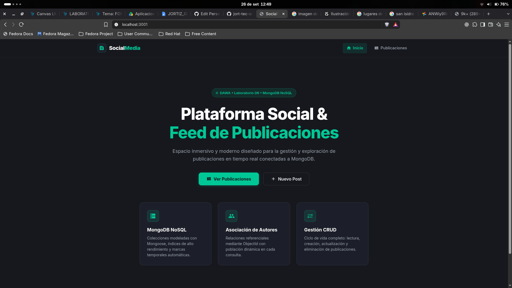
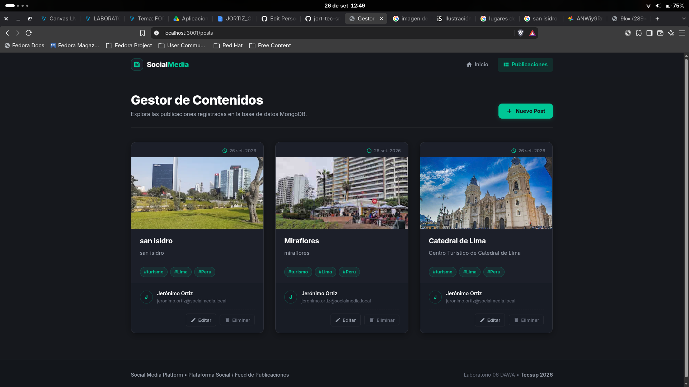
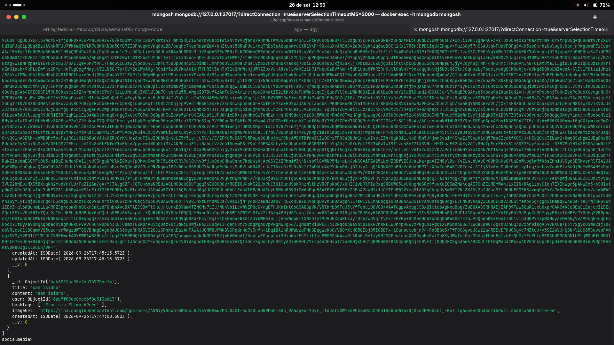

# Laboratorio 06 Base de Datos NoSQL

Aplicación web desarrollada con Node.js, Express, EJS, Mongoose y MongoDB para gestionar publicaciones de una red social. El proyecto implementa operaciones CRUD de Posts y almacena la información de forma persistente en MongoDB ejecutado mediante Docker.

## Funcionalidades

- Conexión de Node.js a MongoDB mediante Mongoose.
- Modelo `User` con validaciones de nombre, apellido, correo, edad mínima, teléfono y contraseña.
- Modelo `Post` relacionado con `User` mediante `ObjectId`.
- Validación de título, contenido, hashtags, URL de imagen y fechas de creación y actualización.
- Listado de publicaciones con datos de su autor.
- Registro de nuevos Posts desde la interfaz web.
- Edición de Posts existentes.
- Eliminación de Posts.
- Persistencia de datos en la base de datos `socialmedia`.

## Tecnologías utilizadas

- Node.js
- Express
- EJS
- MongoDB 8
- Mongoose
- Docker
- Nodemon
- HTML, CSS y JavaScript

## Estructura del proyecto

```text
mongo-node/
├── app.js
├── package.json
├── .env
├── .gitignore
├── evidencias/
└── src/
    ├── controllers/
    │   └── postController.js
    ├── db/
    │   └── database.js
    ├── models/
    │   ├── Post.js
    │   └── User.js
    ├── repositories/
    │   ├── postRepository.js
    │   └── userRepository.js
    ├── routes/
    │   ├── home.routes.js
    │   └── post.routes.js
    ├── scripts/
    │   └── seed.js
    ├── services/
    │   └── postService.js
    └── views/
        ├── home.ejs
        └── posts/
            ├── form.ejs
            └── index.ejs
```

## Requisitos

- Node.js 20 o superior.
- Docker instalado y en ejecución.
- Puerto `27017` disponible para MongoDB.
- Puerto `3001` disponible para la aplicación web.

## Configuración de MongoDB

Crear el contenedor local de MongoDB:

```bash
docker volume create mongodb_data

docker run -d \
  --name mongodb \
  --restart unless-stopped \
  -p 127.0.0.1:27017:27017 \
  -v mongodb_data:/data/db \
  mongo:8.0
```

Verificar el estado del contenedor:

```bash
docker ps --filter name=mongodb
docker exec -it mongodb mongosh --eval 'db.runCommand({ ping: 1 })'
```

## Variables de entorno

Crear un archivo `.env` en la raíz del proyecto:

```env
MONGO_URI=mongodb://127.0.0.1:27017/socialmedia
PORT=3001
```

> El archivo `.env` está incluido en `.gitignore` y no debe subirse al repositorio.

## Instalación y ejecución

```bash
npm install
npm run seed
npm run dev
```

Abrir la aplicación en:

```text
http://localhost:3001
```

## Scripts disponibles

| Comando | Descripción |
|---|---|
| `npm run dev` | Inicia el servidor con recarga automática mediante Nodemon. |
| `npm start` | Inicia el servidor con Node.js. |
| `npm run seed` | Crea un usuario de prueba para asignar autores a los Posts. |

## Consultas en MongoDB

Ingresar a la consola de MongoDB:

```bash
docker exec -it mongodb mongosh
```

Consultar las colecciones:

```javascript
use socialmedia
show collections

db.users.find()
db.posts.find()
```

## Rutas principales

| Método | Ruta | Descripción |
|---|---|---|
| GET | `/` | Muestra la página principal. |
| GET | `/posts` | Lista todos los Posts registrados. |
| GET | `/posts/new` | Muestra el formulario de creación. |
| POST | `/posts` | Registra un nuevo Post. |
| GET | `/posts/:id/edit` | Muestra el formulario de edición. |
| POST | `/posts/:id` | Actualiza un Post. |
| POST | `/posts/:id/delete` | Elimina un Post. |

## Evidencias

Las capturas finales del laboratorio se almacenan en la carpeta `evidencias/`.

## Evidencias

### Interfaz



### Publicaciones



### Persistencia en MongoDB



## Conclusiones

1. Se comprobó que MongoDB permite almacenar información documental de manera flexible y, por ello, facilitó la creación de las colecciones Users y Posts para la aplicación.  
2. Asimismo, Mongoose permitió definir modelos con validaciones y relaciones mediante ObjectId, por lo que se evitó el registro de datos incompletos o inconsistentes.  
3. Además, la separación en modelos, repositorios, servicios y controladores organizó el código y, en consecuencia, simplificó el mantenimiento de las operaciones CRUD.  
4. Por otra parte, la integración de Express con EJS permitió visualizar, crear, editar y eliminar publicaciones desde una interfaz web conectada a MongoDB.  
5. Finalmente, el uso de Docker para MongoDB garantizó un entorno local reproducible y, a la vez, evitó instalar el servidor de base de datos directamente en Fedora.  